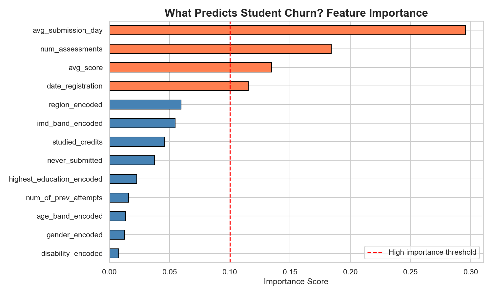
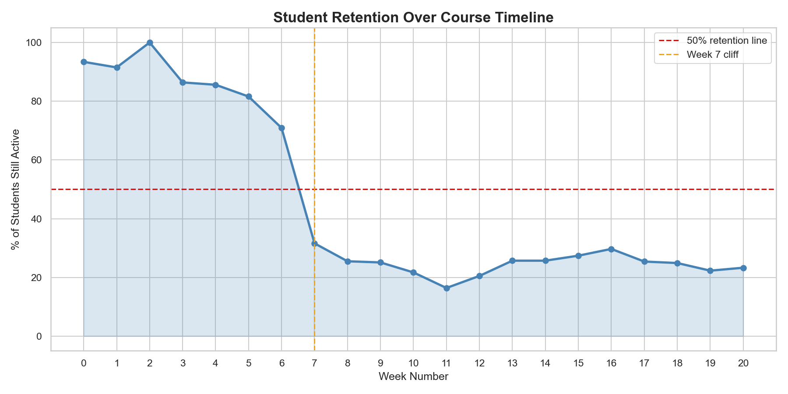
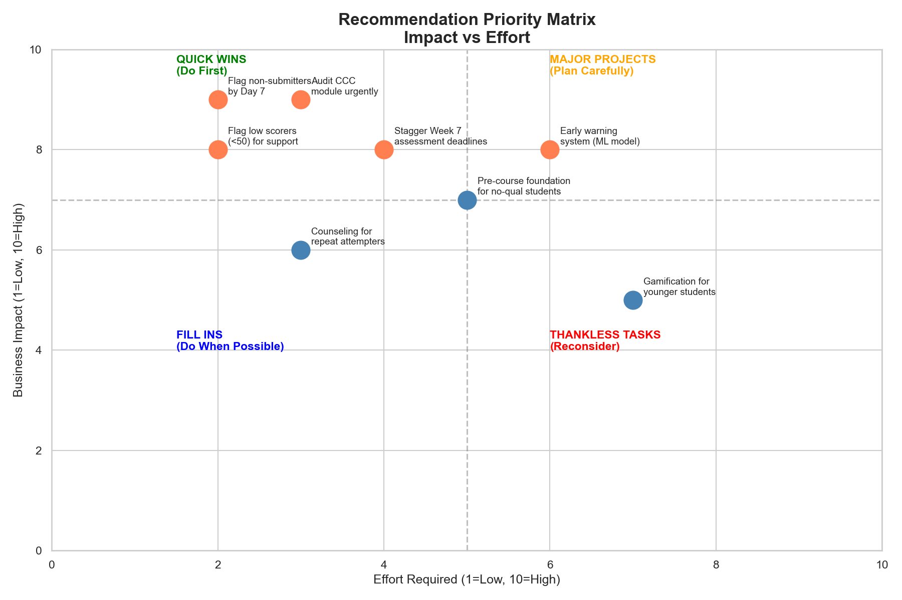

# Student Churn Prediction & Retention Analysis

**Predicting which of 32,593 online-university students will withdraw — and what to do about it.**

Built on the [Open University Learning Analytics Dataset (OULAD)](https://analyse.kmi.open.ac.uk/open_dataset): real demographic, registration, assessment, and clickstream data from 7 course modules of a UK online university. The pipeline cleans and merges five raw tables, engineers 13 behavioral features, and trains a churn classifier — then converts the model's findings into a prioritized retention plan.

## Headline results

| | |
|---|---|
| Students analyzed | 32,593 (6,519 held out for testing) |
| Baseline withdrawal rate | 31.2% |
| Model | Random Forest (100 trees, class-balanced) |
| Test accuracy | **0.82** |
| Test ROC-AUC | **0.895** |
| Churned-class precision / recall | 0.72 / 0.69 |



## The finding that matters most

**Students who never submit an assessment withdraw at 79.5% — 2.5× the 31.2% baseline.** That's 5,847 students identifiable within weeks of enrollment, before any model is needed. The single highest-leverage retention action is an early-alert on assessment non-submission.



Other patterns from the EDA:

- **Module design matters more than demographics:** churn ranges from 11.5% (module GGG) to 44.5% (module CCC) — a 33-point gap across modules, dwarfing any demographic effect.
- **Score gap:** churned students average 66.6 on assessments vs. 74.4 for retained students — struggling students signal early through grades, not just absence.
- Age band, education level, and prior attempts each shift churn by meaningful margins (see `charts/`).

## Recommendations (impact vs. effort)

The notebook closes with an insight → impact → recommendation table and this priority matrix:



1. **Assessment non-submission early-alert** — highest impact, low effort: flag students with no submission by week 4.
2. **Audit high-churn modules (CCC, DDD)** against the lowest-churn module's (GGG) structure and pacing.
3. **Score-drop intervention** — outreach triggered when a student's rolling assessment average falls below ~67.
4. **Weight onboarding support by risk segment** using the model's demographic + behavioral risk scores.
5. **Track weekly VLE engagement** as a leading indicator — the retention curve shows disengagement precedes withdrawal.

## Repository structure

```
main.ipynb          the full pipeline: cleaning → EDA → features → model → recommendations
data/               OULAD source tables + cleaned output
charts/             all 10 generated figures
requirements.txt
```

## Reproducing

```
pip install -r requirements.txt
jupyter notebook main.ipynb
```

Run all cells top to bottom. One caveat: the clickstream retention curve (cell 19+) reads `studentVle.csv`, which exceeds GitHub's file-size limit and isn't committed — download it from the [OULAD source](https://analyse.kmi.open.ac.uk/open_dataset) into `data/` to reproduce that section; everything else runs from the committed CSVs.

## Tech stack

Python · pandas · NumPy · scikit-learn · matplotlib · seaborn
