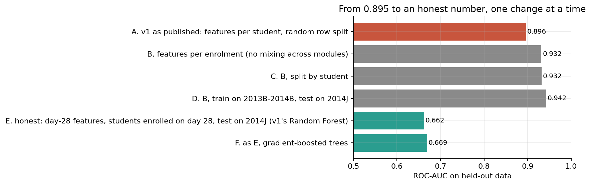
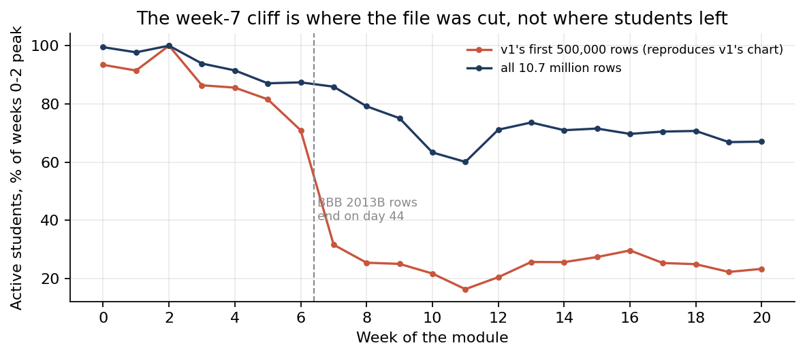
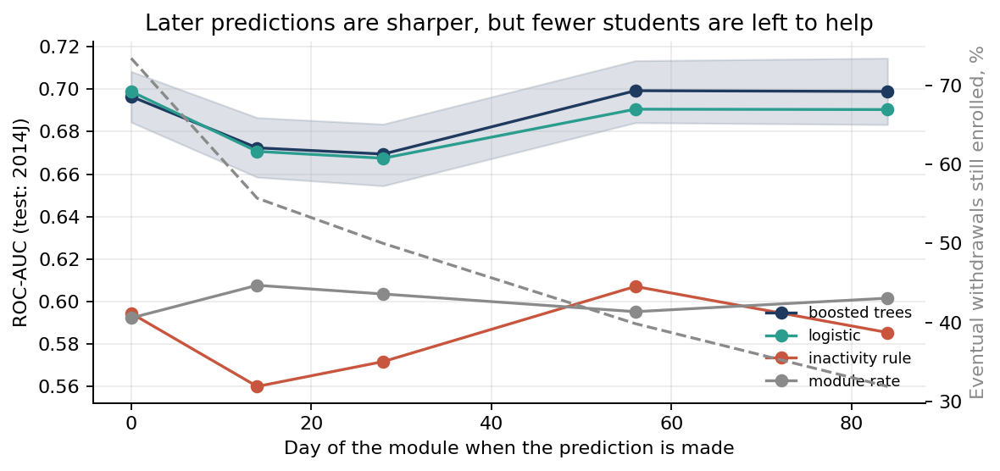

# Student Withdrawal: An Honest Early-Warning System

**Version 1 of this project reported ROC-AUC 0.895. An audit found that most of it came from reading the future, and that its two headline findings were artefacts. This is the rebuild: who will leave an online module, on which day we can know, and how many we can still reach.**

Data: the [Open University Learning Analytics Dataset](https://archive.ics.uci.edu/dataset/349/open+university+learning+analytics+dataset) (OULAD; Kuzilek, Hlosta and Zdrahal 2017, CC BY 4.0): 32,593 enrolments held by 28,785 students in 22 presentations of 7 modules, with 10,655,280 rows of daily clicks.

**Notebook:** [`notebooks/early_warning.ipynb`](notebooks/early_warning.ipynb), step by step, every number printed by a cell.

## What the audit found



- **The 0.895 was mostly leakage.** v1 used features computed over the whole course (assessments submitted, average submission day) to predict withdrawal. A student who leaves in week 3 cannot submit in week 10, so the features record the withdrawal (correlation 0.72 between withdrawal day and assessments submitted). Rebuilt on what is observable on day 28 for students still enrolled then, and tested on a later cohort, the same Random Forest scores **0.662**. About 59% of v1's lift above a coin toss was the model reading the future.
- **Two more bugs, which made it look even better.** Assessment features were grouped by student, not by enrolment, so a student's scores in other modules leaked into each enrolment; and a random row split put 1,121 students in both training and test. Fixing both raised the leaky score to 0.932, which is how you know the problem was time, not identity.
- **The "week-7 cliff" was where the file was cut.** v1 read the first 500,000 rows of the click log, which is sorted by date within each presentation. Those rows stop on day 44 of module BBB 2013B, whose 1,526 students then vanish from the count. The chart reproduces exactly (70.9% to 31.6% active); on all rows, activity goes from 87.4% to 85.9%.
- **"Never-submitters withdraw at 79.5%" was mostly reverse causation.** 79% of the never-submitters who withdrew had left before their first assessment was even due. The forward-looking version holds up: among 27,782 enrolments still registered at their first deadline, the 8,951 who missed it withdrew at **31.8% against 13.4%**, 2.4 times as often.



## The early-warning system

For each day *k* of the module, the at-risk set is every enrolment still registered on day *k*; features use only data dated before day *k* (clicks, deadlines due and met, marks, registration); models train on the 2013B, 2013J and 2014B presentations and are tested on **2014J**, the last cohort. Settings were fixed before looking at the test set.

| Day *k* | Test enrolments | Eventual withdrawal rate | AUC, boosted trees (95% CI) | AUC, logistic | AUC, target "not passing" | Eventual withdrawals still reachable |
|---|---|---|---|---|---|---|
| 0 | 10,147 | 27.8% | 0.697 (0.684-0.708) | 0.699 | 0.717 | 73.4% |
| 14 | 9,247 | 19.8% | 0.672 (0.659-0.687) | 0.671 | 0.727 | 55.7% |
| 28 | 9,127 | 18.6% | 0.669 (0.654-0.684) | 0.667 | 0.725 | 50.0% |
| 56 | 8,792 | 15.5% | 0.699 (0.684-0.713) | 0.691 | 0.784 | 39.8% |
| 84 | 8,484 | 12.4% | 0.699 (0.683-0.715) | 0.690 | 0.810 | 31.9% |



- **Earliness against accuracy.** 26.6% of withdrawals happen before the module starts and half by day 27. Waiting for marks sharpens the prediction while the students it is meant to help leave: by day 84 under a third of eventual withdrawals are still enrolled.
- **The target matters more than the model.** Failing and withdrawing students behave alike, so "withdraw vs everyone else" (v1's definition) is hard to separate. Asking "who will not pass?" lifts day-28 AUC to 0.725 and day-84 AUC to 0.810. A support team wants to reach both groups, so that is the recommended target.
- **Logistic regression matches the trees** (the bootstrap interval for the difference covers zero on four of five days), so the transparent model is the better tool.
- **On day 28, if tutors can contact 10% of the cohort**, the list is 39.9% eventual leavers (2.1 times the base rate) and reaches 21.5% of them, against 12.4% for an inactivity rule. Flagged students who left did so a median 61.5 days later. Predicted risk is calibrated within 6.8 points across deciles.
- **Error rates across groups.** Calibration is within 3 points in every group checked. The model flags more deprived and disabled students more often, in line with their higher withdrawal rates. It separates leavers less well for women (AUC 0.634) than for men (0.697), which a deployment should report.
- **Modules.** After adjusting for who enrols, CCC still loses 44% of its students, so v1's call to examine CCC's design survives; GGG's low rate (11.4%) is partly its intake (18.4% adjusted).

Survival analysis (Kaplan-Meier by module, weekly hazards against assessment deadlines), calibration, capacity and lead-time charts are in the notebook and `results/figures/`.

## What changed from v1

| v1 (Feb 2026) | v2 (Oct 2026) |
|---|---|
| ROC-AUC 0.895 | 0.669 on day 28 for students still enrolled, tested on a later cohort; 0.725 for "not passing" |
| 32,593 students | 32,593 enrolments, 28,785 students |
| Never-submitters withdraw at 79.5% | Missing the first deadline: 31.8% vs 13.4% |
| Week-7 cliff | A sampling artefact |
| Module CCC 44.5% vs GGG 11.5% | CCC holds after adjustment; GGG partly intake |
| Behaviour beats demographics | Holds |

v1's notebook (`main.ipynb`) and charts (`charts/`) are kept unchanged as the record of what was claimed.

## Reproduce

```bash
python -m venv .venv && .venv/bin/pip install -r requirements.txt
.venv/bin/python scripts/get_data.py            # fetches the 454 MB click log, checks the other tables
cd notebooks && ../.venv/bin/jupyter nbconvert --to notebook --execute --inplace early_warning.ipynb
```

The notebook is paired with `notebooks/early_warning.py` (jupytext), which is the readable source. Every number above is printed by a cell and saved in `results/metrics.json`; tables are in `results/*.csv`.

## Layout

```
notebooks/early_warning.ipynb   v2 analysis, executed (source: early_warning.py)
src/oulad_ew.py                 at-risk sets and features observable before day k
scripts/get_data.py             downloads studentVle.csv from UCI, verifies the committed tables
results/                        metrics.json, tables and figures
data/                           OULAD tables (studentVle.csv is fetched, not committed)
main.ipynb, charts/             v1, unchanged
```

## Limits

One university, 2013 and 2014; one test cohort; reasons for leaving are not recorded; OULAD does not say when marks were returned, so scores are treated as known on submission; nothing here measures whether an intervention works, only whom it should reach first.
